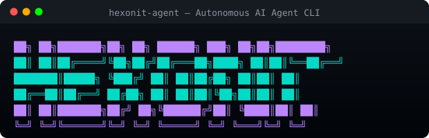

<p align="center">
  
  
  
  
</p>

<p align="center">
  
</p>

<h1 align="center">Hexonit Agent</h1>
<p align="center"><strong>Autonomous AI Agent CLI</strong> — Çift dilli, hafızalı, bilinçli yapay zeka asistanı</p>
<p align="center"><em>Bilingual, memory-enabled, self-aware AI assistant for your terminal</em></p>

<br>

<p align="center">
  <strong>⚠ BETA</strong> — Hata yapabilir / May make mistakes
</p>

<br>

---

## 📦 Tek Satır Kurulum / One-Liner Install

### Windows (PowerShell)
```powershell
iwr -useb https://raw.githubusercontent.com/met1yann/hexonit-agent/main/install.ps1 | iex
```

### macOS / Linux (bash)
```bash
curl -fsSL https://raw.githubusercontent.com/met1yann/hexonit-agent/main/install.sh | sh
```

Kurulumdan sonra terminali yeniden başlatıp aşağıdaki adımları takip edin:
After installation, restart your terminal and follow these steps:

```bash
# Yapılandır / Configure
hexonit setup

# Sohbet başlat / Start chatting
hexonit chat
```

---

## 🚀 Hızlı Başlangıç / Quick Start

### Yapılandırma / Configuration
```bash
hexonit setup
```
6 adımlı sihirbaz: Sağlayıcı → Model → Tema → API Anahtarı → Dil → Bilinç Modu
*6-step wizard: Provider → Model → Theme → API Key → Language → Consciousness*

### Sohbet Başlatma / Start Chat
```bash
hexonit chat                     # İnteraktif oturum / Interactive session
hexonit chat -p openai -m gpt-4o # Belirli model ile / With specific model
hexonit chat -c                  # Kaldığın yerden devam et / Continue last session
hexonit chat --fork              # Oturumu çatalla / Fork the session
```

### Tek Seferlik Çalıştırma / Single Run
```bash
hexonit run "Dosyaları listele ve özet çıkar"
hexonit run "Analyze this project structure" -p anthropic -m claude-sonnet-4-20250514
```

---

## 🌐 Dil Desteği / Language Support

Hexonit **Türkçe** ve **English** dillerini otomatik algılar. Kullanıcı hangi dilde yazarsa, aynı dilde yanıt verir.

Hexonit **auto-detects** Turkish and English. It responds in whichever language you write in.

```
Siz: Merhaba, dosyaları listeler misin?
Hexonit: Merhaba! İşte dizin yapısı...

You: Hello, can you list the files?
Hexonit: Hello! Here is the directory structure...
```

Ayarlardan zorla dil seçebilirsiniz / You can force a language in settings:
```bash
hexonit setup  # Dil seçeneğinden / From language option
# veya sohbet içinde / or in-chat:
/lang          # tr veya en seç / choose tr or en
```

---

## 🧠 Özellikler / Features

### 🤖 Yapay Zeka / AI Capabilities
| Özellik | Açıklama | Feature |
|---------|----------|---------|
| ✅ **Çoklu Sağlayıcı** | OpenAI, Anthropic, Groq, OpenRouter (100+ model) | **Multi-Provider** |
| ✅ **Gerçek Zamanlı** | Token token yanıt akışı | **Real-Time Streaming** |
| ✅ **Araç Kullanımı** | Bash, dosya, web, GitHub, Telegram | **Tool Execution** |
| ✅ **Otonomi** | Çok adımlı görevleri kendi başına çözer | **Autonomous Loop** |

### 🧠 Bilinç ve Hafıza / Consciousness & Memory
| Özellik | Açıklama | Feature |
|---------|----------|---------|
| ✅ **Kendi Kendine Düşünme** | Yanıt vermeden önce iç muhakeme | **Self-Think / Bilinç Modu** |
| ✅ **Uzun Süreli Hafıza** | Oturumlar arası kalıcı bellek | **Long-Term Memory** |
| ✅ **Bağlamsal Hatırlama** | Geçmiş konuşmaları otomatik hatırlama | **Contextual Recall** |
| ✅ **Öğrenme** | Önemli bilgileri otomatik kaydetme | **Auto-Learning** |

### 🎨 Arayüz / Interface
| Özellik | Açıklama | Feature |
|---------|----------|---------|
| ✅ **Profesyonel Tema** | Hermes, Matrix, Dracula, Default | **Theming System** |
| ✅ **Tam Renk Desteği** | 256 renk, kutular, simgeler | **Full Color UI** |
| ✅ **Dosya Referansı** | `@` ile dosya içeriği ekleme | **@file References** |
| ✅ **Shell Komutu** | `!` ile terminal komutu çalıştırma | **!shell Commands** |
| ✅ **Oturum Yönetimi** | Kaydet, çatalla, devam et, dışa aktar | **Session Management** |

### 🛡️ Güvenlik / Security
| Özellik | Açıklama | Feature |
|---------|----------|---------|
| ✅ **Korumalı Alan** | Sandbox modu ile izole çalıştırma | **Sandbox Mode** |
| ✅ **İzin Sistemi** | Her araç çağrısı için onay | **Permission System** |
| ✅ **Oto-Onay** | Güvendiğin araçlar için hızlı mod | **Auto-Approval** |
| ✅ **Sıfırlama** | Tüm ayarları ve anahtarları silme | **Reset Command** |

---

## 📋 Tüm Komutlar / All Commands

### CLI Komutları / CLI Commands
```bash
hexonit setup              # Yapılandırma sihirbazı / Configuration wizard
hexonit chat               # İnteraktif sohbet / Interactive chat
hexonit run "komut"        # Tek seferlik çalıştırma / Single run
hexonit reset              # Fabrika ayarlarına dön / Factory reset
hexonit session list       # Oturumları listele / List sessions
hexonit session delete <id># Oturum sil / Delete session
hexonit session export <id># Oturum dışa aktar / Export session
hexonit export [id]        # Oturumu JSON olarak kaydet / Export as JSON
hexonit continue           # Son oturuma devam et / Continue last session
hexonit fork               # Son oturumu çatalla / Fork last session
hexonit models             # Sağlayıcıları ve modelleri göster / Show providers
hexonit gateway start      # Arka plan servisi başlat / Start daemon
hexonit gateway stop       # Arka plan servisi durdur / Stop daemon
```

### Sohbet İçi Komutlar / In-Chat Commands

| Komut | Türkçe | English |
|-------|--------|---------|
| `/help` | Tüm komutları göster | Show all commands |
| `/new` | Yeni oturum başlat | Start new session |
| `/status` | Agent durumunu göster | Show agent status |
| `/memory` | Hafıza yönetimi | Memory management |
| `/forget` | Hafızayı temizle | Clear memory |
| `/lang` | Dili değiştir | Change language |
| `/think` | Bilinç modunu aç/kapa | Toggle self-think |
| `/tools` | Araçları listele | List tools |
| `/system` | Sistem bilgisi | System info |
| `/tokens` | Token kullanımı | Token usage |
| `/godmode` | Sınırsız mod | Unrestricted mode |
| `/yolomode` | Otonomi modu | Autonomous loop |
| `/sandbox` | Korumalı alan | Sandbox toggle |
| `/model` | Model değiştir | Change model |
| `/sessions` | Oturumları listele | List sessions |
| `/export` | Oturumu dışa aktar | Export session |
| `/copy` | Son yanıtı kopyala | Copy last response |
| `/undo` | Son mesajı geri al | Undo last message |
| `/exit` | Çıkış | Exit |

### Özel Sözdizimi / Special Syntax

```bash
@config.ts            # Dosya içeriğini prompt'a ekler / Adds file content to prompt
!npm run build        # Shell komutu çalıştırır / Runs a shell command
```

---

## 💾 Hafıza Sistemi / Memory System

Hexonit, konuşmalar arasında bilgi hatırlayabilir.

*Hexonit can remember information across conversations.*

| Tür / Type | Açıklama / Description | Süre / Duration |
|------------|------------------------|-----------------|
| **Kısa Süreli** | Mevcut oturum içi bağlam | Oturum boyunca |
| **Uzun Süreli** | Kalıcı hafıza (`~/.hexonit/memory/`) | Kalıcı / Persistent |
| **Dönemsel** | Geçmiş olaylar ve sonuçlar | Kalıcı / Persistent |

```bash
# Hafızayı görüntüle / View memory
/memory

# Hafızada ara / Search memory
/memory -> arama terimin / your search term

# Hafızayı temizle / Clear memory
/forget
```

---

## 🧪 Bilinç Modu / Self-Think (Consciousness) Mode

Etkinleştirildiğinde, Hexonit yanıt vermeden önce **iç monolog** yapar.

*When enabled, Hexonit engages in **internal monologue** before responding.*

1. **Analiz** — Kullanıcının gerçek amacını çözümler
2. **Bağlam** — Hafızadaki ilgili bilgileri değerlendirir
3. **Muhakeme** — Mantıksal çözüm zincirini kurar
4. **Kendini Düzeltme** — Yaklaşımındaki hataları kontrol eder
5. **Yanıt** — Nihai yanıtı üretir

```
/think  # Aç / On
/think  # Kapa / Off
```

---

## 🎨 Temalar / Themes

| Tema | Renkler | Görünüm |
|------|---------|---------|
| **Hermes** (varsayılan) | Mor & Camgöbeği | Modern |
| **Matrix** | Yeşil & Siyah | Hacker |
| **Dracula** | Koyu pastel | Göz dostu |
| **Default** | Sistem renkleri | Minimal |

```bash
hexonit setup  # Tema seçimi / Theme selection
```

---

## 🔄 Oturum Yönetimi / Session Management

Tüm konuşmalar otomatik kaydedilir (`~/.hexonit/sessions/`).

*All conversations are auto-saved.*

```bash
hexonit session list         # Tüm oturumları listele
hexonit continue             # Son oturuma devam et
hexonit fork                 # Son oturumu çatalla (yeni bağlam)
hexonit export abc123        # Oturumu JSON dışa aktar
hexonit session delete abc123 # Oturumu sil
```

---

## ⚙️ Yapılandırma / Configuration

Dosya / File: `~/.hexonit/config.json`

```json
{
  "defaultProvider": "openrouter",
  "defaultModel": "anthropic/claude-3-haiku",
  "uiTheme": "hermes",
  "language": "auto",
  "selfThink": false,
  "memoryEnabled": true,
  "maxIterations": 25,
  "autoConfirm": false,
  "godMode": false,
  "safeMode": false,
  "keys": {}
}
```

### Ortam Değişkenleri / Environment Variables

| Değişken | Variable | Amaç / Purpose |
|----------|----------|----------------|
| `OPENAI_API_KEY` | OpenAI API anahtarı | OpenAI provider |
| `ANTHROPIC_API_KEY` | Anthropic API anahtarı | Anthropic/Claude |
| `GROQ_API_KEY` | Groq API anahtarı | Groq provider |
| `OPENROUTER_API_KEY` | OpenRouter API anahtarı | OpenRouter (100+ models) |
| `HEXONIT_PROVIDER` | Varsayılan sağlayıcı | Default provider |
| `HEXONIT_MODEL` | Varsayılan model | Default model |
| `HEXONIT_THEME` | Tema adı | Theme (hermes/matrix/dracula/default) |

---

## 🛠️ Geliştirme / Development

```bash
# Repoyu klonla / Clone the repo
git clone https://github.com/met1yann/hexonit-agent.git
cd hexonit-agent

# Bağımlılıkları yükle / Install dependencies
npm install

# Geliştirme modunda çalıştır / Run in dev mode
npm run dev chat
npm run dev setup

# Derle / Build for production
npm run build

# Çalıştır / Run
npm start

# Sıfırla / Reset
npm run reset
```

---

## 🏗️ Proje Mimarisi / Project Structure

```
hexonit-agent/
├── src/
│   ├── cli/           # CLI komutları (index, chat, setup, gateway)
│   ├── core/          # Çekirdek (agent, memory, language, consciousness)
│   ├── providers/     # AI sağlayıcıları (openai, anthropic, groq, openrouter)
│   ├── tools/         # Araçlar (bash, file, browser, web, github, telegram)
│   ├── jailbreak/     # Godmode stratejileri
│   └── utils/         # Yardımcılar (config, logger, themes)
├── install.ps1        # Windows kurulum scripti
├── install.sh         # Unix kurulum scripti
└── package.json
```

---

## ⚠️ Beta Uyarısı / Beta Notice

```
╔════════════════════════════════════════╗
║      ⚠  HEXONIT BETA  ⚠              ║
║  Hata yapabilir / May make mistakes   ║
║  Geri bildirim: github.com/issues     ║
╚════════════════════════════════════════╝
```

- Bazı özellikler kararsız olabilir / Some features may be unstable
- API değişiklikleri olabilir / API may change
- Geri bildiriminiz önemli / Your feedback matters
- [Issue açın](https://github.com/met1yann/hexonit-agent/issues) / [Open an issue](https://github.com/met1yann/hexonit-agent/issues)

---

## 📄 Lisans / License

**GNU Affero General Public License v3.0 (AGPL-3.0)**

Bu proje özgür bir yazılımdır. Kullanabilir, değiştirebilir ve paylaşabilirsiniz.
Ancak **ağ üzerinden kullandırdığınızda kaynak kodunu açmak zorundasınız.**

This program is free software. You may use, modify, and redistribute it.
If you run it on a network and allow users to interact with it, **you must disclose the source code.**

Full license: [LICENSE](LICENSE)

---

<p align="center">
  <strong>Hexonit Agent</strong> — Terminalinizde yapay zeka / AI in your terminal
  <br>
  Made with ❤️ by <a href="https://github.com/met1yann">met1yann</a>
</p>
